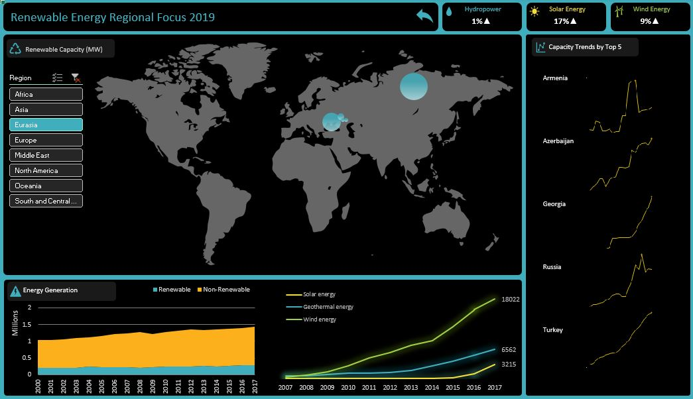

# Objective
The goal is to visualize the development in the field of different kind of renewable and the economic drive produced by them. 

# Achievement
* Dashboard is created to visualize the factors like the jobs produced, global consumption, investment, energy generation and comparision of different kind of energy 
* Analysis on basis of the geographical region can also be done using this dash
* Analysis can also be done according to different time periods for sum features

# Dashboard
This is dashboard and a drilldown page is also created for detail oriented persons, which can be accessed from dashboard by clicking on the text "Click here for drilldown"

This is drilldown page

